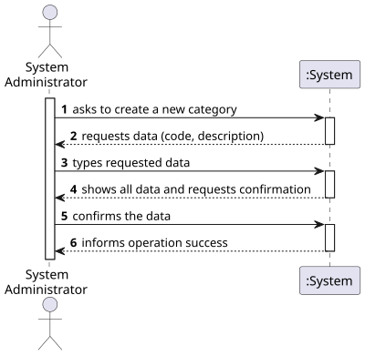
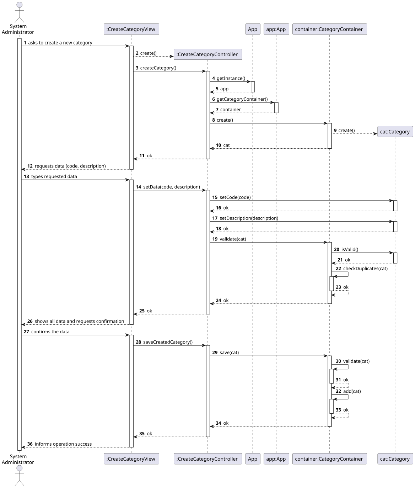
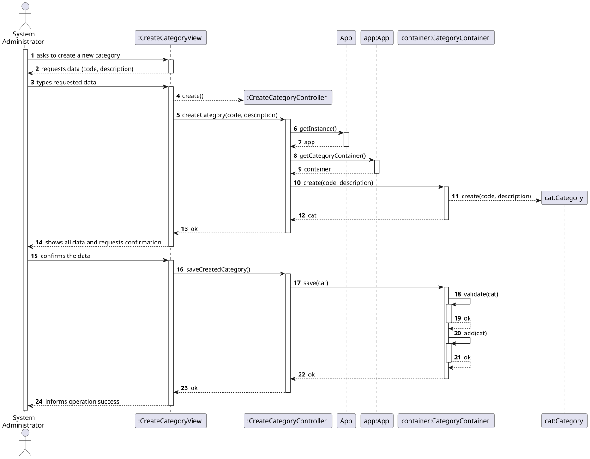
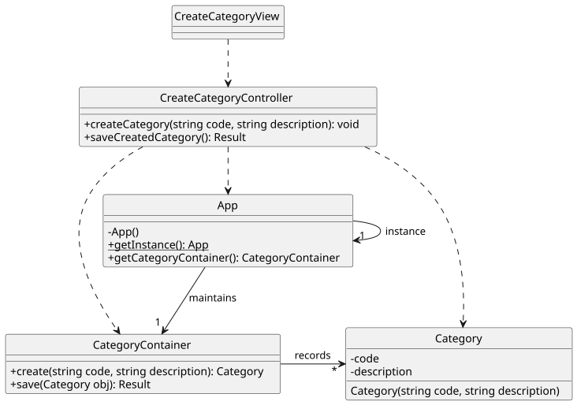

# US 01 - Create a category

## 1. Requirements Engineering

### 1.1. User Story Description

As System Administrator, I want to create a new category.

### 1.2. Customer Specifications and Clarifications 

**From the specifications document:**

> By simplicity, a category just comprehends a unique alphanumeric code and a brief description.

**From the client clarifications:**

> **Question:** ?
>
> **Answer:** *

### 1.3. Acceptance Criteria

- AC01-1: The category code cannot be empty or have less than five characters.
- AC01-2: The category description cannot be empty.

### 1.4. Found out Dependencies

- No dependencies were found.

### 1.5 Input and Output Data

**Input Data:**

- Typed data:
    - a code
    - a description

- Selected data:
    - n/a

**Output Data:**

- (In)success of the operation

### 1.6. System Sequence Diagram (SSD)

### 1.7 Other Relevant Remarks

- The created category is ready to be used in task categorization.

## 2. OO Analysis

### 2.1. Relevant Domain Model Excerpt 

### 2.2. Other Remarks

- n/a

## 3. Design - User Story Realization 

### 3.1. Rationale

| Interaction ID | Question: Which class is responsible for...       | Answer                   | Justification (with patterns)                                                                                             |
|:---------------|:--------------------------------------------------|:-------------------------|:--------------------------------------------------------------------------------------------------------------------------|
| Step 1 | ... interacting with the actor?                   | CreateCategoryView       | Pure Fabrication: there is no reason to assign this responsibility to any existing class in the Domain Model.    |
| Step 2 | ... requesting data?                              | CreateCategoryView       | IE: CreateCategoryView is responsible for user interactions.                                                        |
| Step 3 | ... keeping the inputted data?                    | CreateCategoryView       | IE: CreateCategoryView is responsible for temporarily keeping the inputted data.                                                 |
|        | ... coordinating the US?                          | CreateCategoryController | Controller                                                                                                 |
|        | ... maintaining categories?                       | App                      | App works as a Singleton. IE: App maintains categories.                                                                   |
|        |                                                   | CategoryContainer        | By applying High Cohesion (HC) + Low Coupling (LC) on class App, the responsibility is delegated on CategoryContainer. CategoryContainer is obtaied by Pure Fabrication.   |
|        | ... instantiating a new category?                 | CategoryContainer        | Creator (Rule 1): CategoryContainer contains instances of Category.                                                          |
|        | ... validating the data (local validation)?       | Category                 | IE: Category owns its data.                                                                                                        |
| Step 4 | ... showing all data and requesting confirmation? | CreateCategoryView       | IE: CreateCategoryView is responsible for user interactions.                                                                  |
| Step 5 | ... validating the data (global validation)?      | CategoryContainer        | IE: CategoryContainer knows all existing categories.                                                                        |
|        | ... saving the created category?                  | CategoryContainer        | IE: CategoryContainer records all existing categories.                                                                                 |
| Step 6 | ... informing operation success?                  | CreateCategoryView       | IE: CreateCategoryView is responsible for user interactions.                                                                       |

**Note that this rationale is consistent with the Sequence Diagram of Alternative 2.**

### Systematization

According to the taken rationale, the conceptual classes promoted to software classes are:

- Category

Other software classes (i.e. Pure Fabrication) identified:

- CreateCategoryView
- CreateCategoryController
- App
- CategoryContainer

### 3.2. Sequence Diagram (SD)

**Alternative 1**

Can you enumerate any problems with this conceptual solution? **Yes, several:**

- The Category object is created in an invalid state, which violates some of the best OO principles;
- Due to previous issue, "isValid" methods become, unnecessarily, required;
- Also, "set" methods are required.

**How to avoid such problems without modifying the spirit of the US flow previously defined?**

**Alternative 2**

**Note that this alternative is consistent with the rationale presented above.**

**Notice that:**

- The US flow is kept;
- While creating a Category object, the constructor can check whether it is in a valid state or not. If not, it should fail;
- "isValid" method was avoided;
- "set" methods were completely avoided;
- OO best principles are being followed.

As a result, the conceptual solution become easier to understand and maintain.

**You should adopt this approach.**

### 3.3. Class Diagram (CD)

**Note: private methods were omitted.**

## 4. Tests

Three relevant test scenarios are highlighted next.
Other test were also specified.

**Test 1:** Check that it is not possible to create an instance of the Category class with invalid values. 

      TEST_F(CategoryFixture, CreateWithEmptyCode){
          EXPECT_THROW(new Category(L"",L"Category One"),std::invalid_argument);
      }

      TEST_F(CategoryFixture, CreateWithCodeHavingFourChars){
          EXPECT_THROW(new Category(L"C001",L"Category One"),std::invalid_argument);
      }

**Test 2:** Check that it is possible to create an instance of the Category class with valid values.

      TEST_F(CategoryFixture, CreateWithValidData){
          EXPECT_NO_THROW(new Category(L"C0001",L"Category One"));
      }

**Test 3:** Check that it is possible create and add/save a category on the container.
    
      TEST_F(CategoryContainerFixture, AddingOneCategory){
          EXPECT_TRUE(this->container->isEmpty());
          shared_ptr<Category> cat = this->container->create(L"C0019", L"Category 19");
          this->container->save(cat);
          EXPECT_FALSE(this->container->isEmpty());
      }

## 5. Construction (Implementation)

- n/a

## 6. Integration and Demo 

A menu option on the console application was added. Such option invokes the CreateCategoryView.

    int CategoriesMenuView::processMenuOption(int option) {
        int result = 0;
        BaseView * view;
        switch (option) {
          case 1:
            view = new CreateCategoryView(this->userToken);
            view->show();
            break;
          ...
        }
        return result;
    }
      

## 7. Observations

- n/a