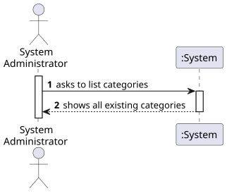
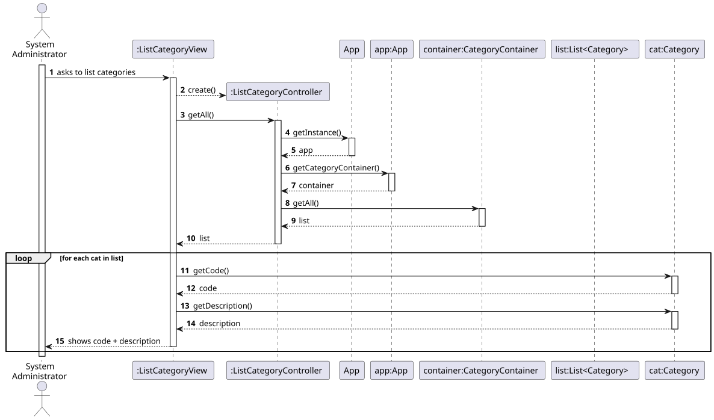
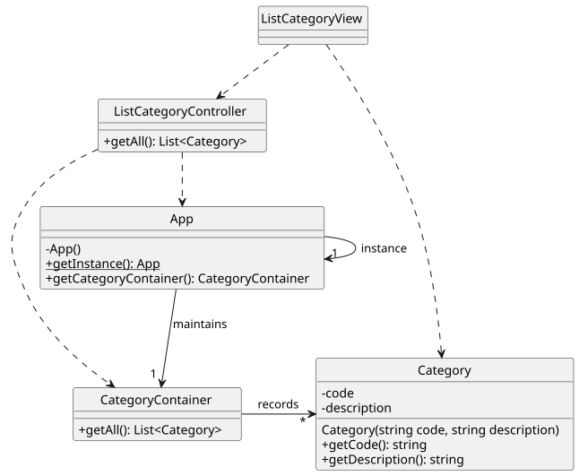

# US 02 - List all categories

## 1. Requirements Engineering

### 1.1. User Story Description

As System Administrator, I want to see a list of all existing categories.

### 1.2. Customer Specifications and Clarifications 

**From the specifications document:**

> A user might categorize tasks using a set of categories maintained by him/her.
> By simplicity, a category just comprehends a unique alphanumeric code and a brief description.

**From the client clarifications:**

> **Question:** Is it necessary to provide sorting and filtering mechanisms?
>
> **Answer:** Such mechanisms are desired, but not yet.

### 1.3. Acceptance Criteria

- Not provided.
- No implicit AC were found.

### 1.4. Found out Dependencies

- No dependencies were found. 
- However, categories must be previously created ([US01](../US01/US01.md)).

### 1.5 Input and Output Data

**Input Data:**

- Typed data:
    - n/a

- Selected data:
    - n/a

**Output Data:**

- The list of existing categories

### 1.6. System Sequence Diagram (SSD)

### 1.7 Other Relevant Remarks

- n/a

## 2. OO Analysis

### 2.1. Relevant Domain Model Excerpt 

### 2.2. Other Remarks

- n/a

## 3. Design - User Story Realization 

### 3.1. Rationale

| Interaction ID | Question: Which class is responsible for... | Answer  | Justification (with patterns)  |
|:-------------  |:--------------------------------------------|:------------|:---------------------------- |
| Step 1  		 | 	... interacting with the actor?            | ListCategoryView       | Pure Fabrication: there is no reason to assign this responsibility to any existing class in the Domain Model.           |
| 			  	 | 	... coordinating the US?                   | ListCategoryController | Controller                             |
| 			  	 | 	... knowing all existing categories?       | App                    | App works as a Singleton. IE: App knows all existing categories.  |
| 			  	 | 	                                           | CategoryContainer      | By applying High Cohesion (HC) + Low Coupling (LC) on class App, the responsibility is delegated on CategoryContainer. CategoryContainer is obtaied by Pure Fabrication.   |
| 			  	 | ... knowing each category data?             | Category               | IE: Category knows its own data.  |
| Step 2  		 | ... listing all categories?                 | ListCategoryView       | IE: ListCategoryView is responsible for user interactions.    |

### Systematization

According to the taken rationale, the conceptual classes promoted to software classes are:

- Category

Other software classes (i.e. Pure Fabrication) identified:

- ListCategoryView
- ListCategoryController
- App
- CategoryContainer

### 3.2. Sequence Diagram (SD)

**Doubts:**

- Does it make any sense for the UI (View) to directly access domain objects (category object, in this case)?
- What are the risks of doing this?
- Is there any way to prevent this from happening?

### 3.3. Class Diagram (CD)

**Note: private attributes and/or methods were omitted.**

## 4. Tests

Two relevant test scenarios are highlighted next.
Other test were also specified.

**Test 1:** Getting all existing categories when no one exists. 

     TEST_F(CategoryContainerFixture, GetAllWhenEmpty){
        EXPECT_TRUE(this->container->isEmpty());
        list<shared_ptr<Category>> list = this->container->getAll();
        EXPECT_TRUE(list.empty());
    }

**Test 2:** Getting all existing categories when several exists.

    TEST_F(CategoryContainerFixture, GetAllWhenPopulated){
        this->populateWithFourCategories();
        list<shared_ptr<Category>> list = this->container->getAll();
        EXPECT_EQ(list.size(), 4);
    }

## 5. Construction (Implementation)

- n/a

## 6. Integration and Demo 

A menu option on the console application was added. Such option invokes the ListCategoryView.

    int CategoriesMenuView::processMenuOption(int option) {
        int result = 0;
        BaseView * view;
        switch (option) {
          ...
          case 2:
            view = new ListCategoryView(this->userToken);
            view->show();
            break;
          ...
        }
        return result;
    }

## 7. Observations

- n/a