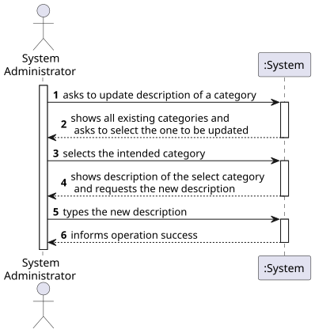
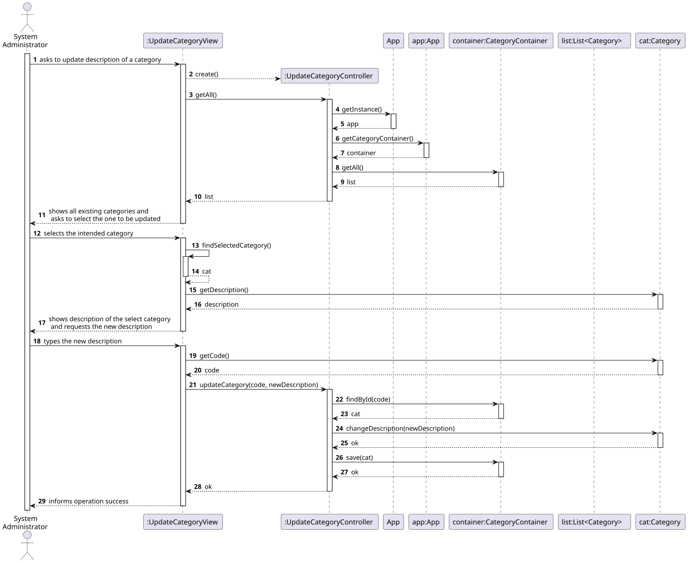
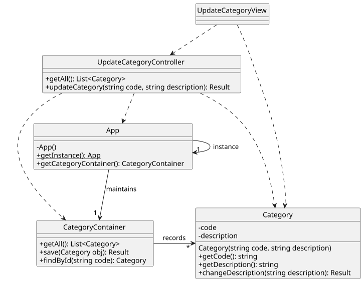

# US 03 - Update category description

## 1. Requirements Engineering

### 1.1. User Story Description

As System Administrator, I want to update the description of an existing category.

### 1.2. Customer Specifications and Clarifications 

**From the specifications document:**

> By simplicity, a category just comprehends a unique alphanumeric code and a brief description.

**From the client clarifications:**

> **Question:** 
>
> **Answer:** 

### 1.3. Acceptance Criteria

- AC01-2. Category description cannot be empty.

### 1.4. Found out Dependencies

- There is a dependency with [US01](../US01/US01.md) since a category must be previously created in order to be updated.

### 1.5 Input and Output Data

**Input Data:**

- Typed data:
    - a description

- Selected data:
    - the category to be updated

**Output Data:**

- The list of existing categories
- (In)success of the operation

### 1.6. System Sequence Diagram (SSD)

### 1.7 Other Relevant Remarks

- The description of the updated category is changed.

## 2. OO Analysis

### 2.1. Relevant Domain Model Excerpt 

### 2.2. Other Remarks

- n/a

## 3. Design - User Story Realization 

### 3.1. Rationale

| Interaction ID | Question: Which class is responsible for...           | Answer  | Justification (with patterns)  |
|:-------------  |:------------------------------------------------------|:------------|:---------------------------- |
| Step 1 | ... interacting with the actor?      | UpdateCategoryView       | Pure Fabrication: there is no reason to assign this responsibility to any existing class in the Domain Model.           |
|        | ... coordinating the US?             | UpdateCategoryController | Controller                             |
|        | ... knowing all existing categories? | App                      | App works as a Singleton. IE: App knows all categories.   |
|        |                                      | CategoryContainer        | By applying High Cohesion (HC) + Low Coupling (LC) on class App, the responsibility is delegated on CategoryContainer. CategoryContainer is obtaied by Pure Fabrication.   |
|        | ... knowing each category data?                       | Category           | IE: Category knows its own data.  |
| Step 2 | ... showing all existing categories?                  | UpdateCategoryView | IE: UpdateCategoryView is responsible for user interactions.    |
| Step 3 | ... knowing which category was selected?              | UpdateCategoryView | IE: UpdateCategoryView is responsible for user interactions. |
| Step 4 | ... knowing the description of the selected category? | Category           | IE: Category knows its own data/description. |
| Step 5 | ... saving the new description?                       | Category           | IE: Category records its own data/description.|
|        | ... saving the modified category?                     | CategoryContainer  | IE: CategoryContainer knows/records all existing categories.|
| Step 6 | ... informing operation success?                      | UpdateCategoryView | IE: is responsible for user interactions.  | 

### Systematization

According to the taken rationale, the conceptual classes promoted to software classes are: 

- Category

Other software classes (i.e. Pure Fabrication) identified:

- UpdateCategoryView
- UpdateCategoryController
- App
- CategoryContainer

### 3.2. Sequence Diagram (SD)

**Doubts:**

- Does it make any sense for the UI (View) to directly access domain objects (category object, in this case)?
- If the UI directly accesses the category object, why doesn't the UI itself invoke the Category's "changeDescription" method?
- Is it acceptable for the UI to change domain objects? 
- Would it be acceptable for the domain layer to receive domain objects (e.g. categories) from the UI?
- How to prevent domain objects from being changed by a "misbehaving" UI?

### 3.3. Class Diagram (CD)

**Note: private attributes and/or methods were omitted.**

## 4. Tests

Three relevant test scenarios are highlighted next.
Other test were also specified.

**Test 1:** Changing to an invalid description. 

     TEST_F(CategoryFixture, ChangingToInvalidDescription){
          Category cat(L"C0001",L"Category One");
          EXPECT_TRUE(cat.changeDescription(L"").isNOK());
          EXPECT_EQ(cat.getDescription(),L"Category One");
      }

**Test 2:** Changing to valid description.

      TEST_F(CategoryFixture, ChangingToValidDescription){
          Category cat(L"C0001",L"Category One");
          EXPECT_TRUE(cat.changeDescription(L"Changed Category").isOK());
          EXPECT_EQ(cat.getDescription(),L"Changed Category");
      }

**Test 3:** Finding categories by id.

    TEST_F(CategoryContainerFixture, FindingCategoriesById){

          this->populateWithFourCategories();
      
          optional<shared_ptr<Category>> obj = this->container->findById(L"C031");
          EXPECT_FALSE(obj.has_value());
      
          obj = this->container->findById(L"C0019");
          EXPECT_TRUE(obj.has_value());
          EXPECT_EQ(obj.value(),cat1);
      
          obj = this->container->findById(L"C0020");
          EXPECT_TRUE(obj.has_value());
          EXPECT_EQ(obj.value(),cat2);
      
          obj = this->container->findById(L"C0021");
          EXPECT_TRUE(obj.has_value());
          EXPECT_EQ(obj.value(),cat3);
      
          obj = this->container->findById(L"C0022");
          EXPECT_TRUE(obj.has_value());
          EXPECT_EQ(obj.value(),cat4);
    }

## 5. Construction (Implementation)

- n/a

## 6. Integration and Demo 

A menu option on the console application was added. Such option invokes the UpdateCategoryView.

    int CategoriesMenuView::processMenuOption(int option) {
        int result = 0;
        BaseView * view;
        switch (option) {
          ...
          case 3:
            view = new UpdateCategoryView(this->userToken);
            view->show();
            break;
          ...
        }
        return result;
    }

## 7. Observations

- n/a