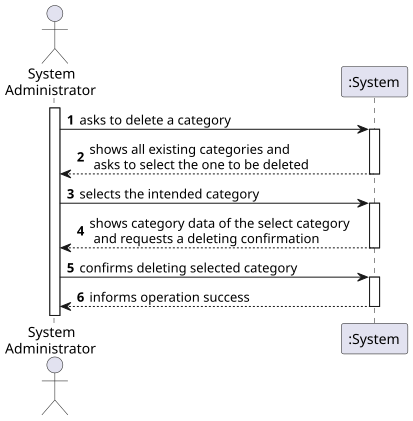
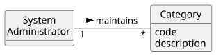
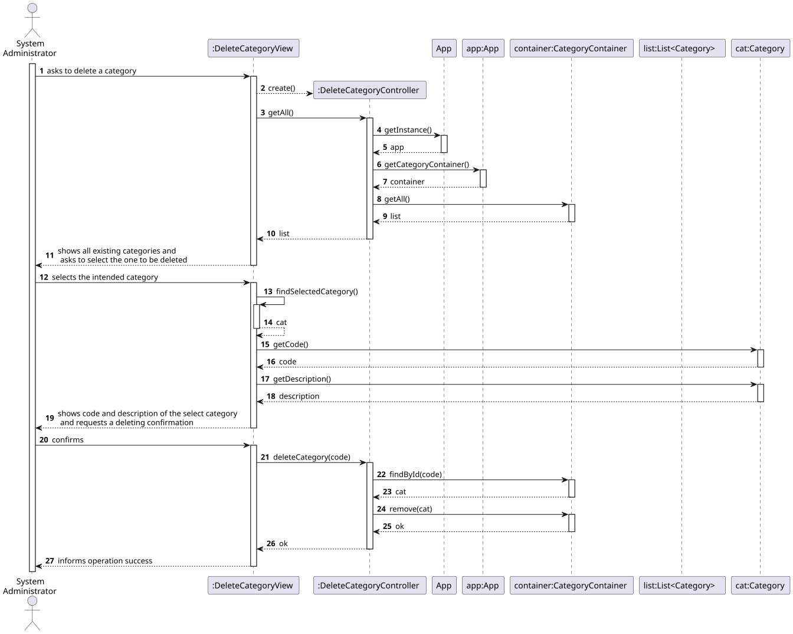
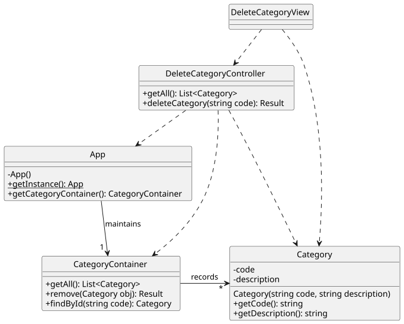

# US 04 - Delete a category 

## 1. Requirements Engineering

### 1.1. User Story Description

As System Administrator, I want to delete an existing category.

### 1.2. Customer Specifications and Clarifications 

**From the specifications document:**

- n/a

**From the client clarifications:**

> **Question:** Is your intention to make a 'soft' or a 'hard' delete?  
>
> **Answer:** Sorry, I do not know the difference between a soft and hard delete.

> **Question:** In a hard delete, the category will be removed and the system will not know that this category ever existed. In a soft delete, the system knows that the deleted category existed and can recover it later. So, which do you prefer?
>
> **Answer:** Ok! For categories, there is no need to make things complicated. Therefore, a hard delete must be made.

### 1.3. Acceptance Criteria

- AC04-1. Category must be hard deleted.

### 1.4. Found out Dependencies

- There is a dependency with [US01](../US01/US01.md) since a category must be previously created in order to be deleted.

### 1.5 Input and Output Data

**Input Data:**

- Typed data:
    - n/a

- Selected data:
    - the category to be deleted

**Output Data:**

- The list of existing categories
- (In)success of the operation

### 1.6. System Sequence Diagram (SSD)

### 1.7 Other Relevant Remarks

- The deleted category does not exist anymore in the system.

## 2. OO Analysis

### 2.1. Relevant Domain Model Excerpt 

### 2.2. Other Remarks

- n/a

## 3. Design - User Story Realization 

### 3.1. Rationale

| Interaction ID | Question: Which class is responsible for... | Answer  | Justification (with patterns)  |
|:-------------  |:--------------------- |:------------|:---------------------------- |
| Step 1 | ... interacting with the actor?                   | DeleteCategoryView |  Pure Fabrication: there is no reason to assign this responsibility to any existing class in the Domain Model.           |
|        | ... coordinating the US?                          | DeleteCategoryController | Controller                             |
|        | ... knowing all existing categories?              | App                | App works as a Singleton. IE: App knows all categories.   |
|        |                                                   | CategoryContainer  | By applying High Cohesion (HC) + Low Coupling (LC) on class App, the responsibility is delegated on CategoryContainer. CategoryContainer is obtaied by Pure Fabrication.  |
|        | ... knowing each category data?                   | Category           | IE: Category knows its own data.  |
| Step 2 | ... showing all existing categories?              | DeleteCategoryView | IE: DeleteCategoryView is responsible for user interactions.    |
| Step 3 | ... knowing which category was selected?          | DeleteCategoryView | IE: DeleteCategoryView is responsible for user interactions. |
| Step 4 | ... knowing the data of the selected category?    | Category           | IE: Category knows its own data. |
| Step 5 | ... removing the selected category from the system? | CategoryContainer | IE: CategoryContainer knows/records all existing categories.|
| Step 6 | ... informing operation success?                  | DeleteCategoryView  | IE: DeleteCategoryView is responsible for user interactions.  | 

### Systematization

According to the taken rationale, the conceptual classes promoted to software classes are:

- Category

Other software classes (i.e. Pure Fabrication) identified:

- DeleteCategoryView
- DeleteCategoryController
- App
- CategoryContainer

### 3.2. Sequence Diagram (SD)

**Doubts:**

- Check out the questions already raised in US02 and US03.

### 3.3. Class Diagram (CD)

**Note: private attributes and/or methods were omitted.**

## 4. Tests

Two relevant test scenarios are highlighted next.
Other test were also specified.

**Test 1:** Trying to remove a non-existing category. 

    TEST_F(CategoryContainerFixture, RemovingNonExistingCategory){
    
        this->populateWithFourCategories();
    
        shared_ptr<Category> obj = this->container->create(L"C0099", L"Category 99");
        EXPECT_FALSE(this->container->remove(obj).isOK());
        EXPECT_EQ(this->container->count(),4);
    }

**Test 2:** Removing an existing category successfully. 

     TEST_F(CategoryContainerFixture, RemovingCategory){

          this->populateWithFourCategories();
      
          EXPECT_TRUE(this->container->remove(cat2).isOK());
          EXPECT_EQ(this->container->count(),3);
          optional<shared_ptr<Category>> obj = this->container->findById(L"C020");
          EXPECT_FALSE(obj.has_value());
      }

**Test 3:** Trying to remove twice the same category should fail at the second try.

    TEST_F(CategoryContainerFixture, RemovingTwiceSameCategory){
    
        this->populateWithFourCategories();
    
        EXPECT_TRUE(this->container->remove(cat3).isOK());
        EXPECT_EQ(this->container->count(),3);
        EXPECT_FALSE(this->container->remove(cat3).isOK());
    }

## 5. Construction (Implementation)

- n/a

## 6. Integration and Demo 

A menu option on the console application was added. Such option invokes the DeleteCategoryView.

    int CategoriesMenuView::processMenuOption(int option) {
        int result = 0;
        BaseView * view;
        switch (option) {
          ...
          case 4:
            view = new DeleteCategoryView(this->userToken);
            view->show();
            break;
          ...
        }
        return result;
    }

## 7. Observations

- n/a